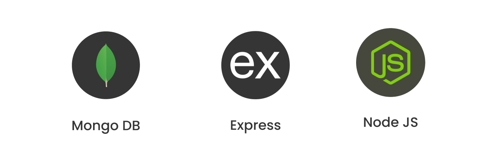

# BoxedFashion.co
#### Personalised outfits at your doorstep, each month! Fashion that defines you. Fashion that expresses you.

Innovative fashion subscription service that connects fashion customers with retailers. The platform offers personalized style recommendations and curated clothing packages based on individual preferences.

## Key features -
1. Personalized style profiles through detailed quizzes
2. Smart outfit suggestions based on user preferences
3. Subscription-based clothing delivery
4. Virtual closet for existing wardrobe items

## Dependancies -
- 

## TechStack used -

- Client-side application
    - Vanilla HTML
    - TailwindCSS
    - MaterialUI
- Server-side application
    - ExpressJS
    - NodeJS
- Database system
    - MongoDB
    - PostgreSQL

- Machine learning model
    - Python
        - Numpy
        - Matplotlib
        - Tensorflow
        - Keras
        - SKlearn

